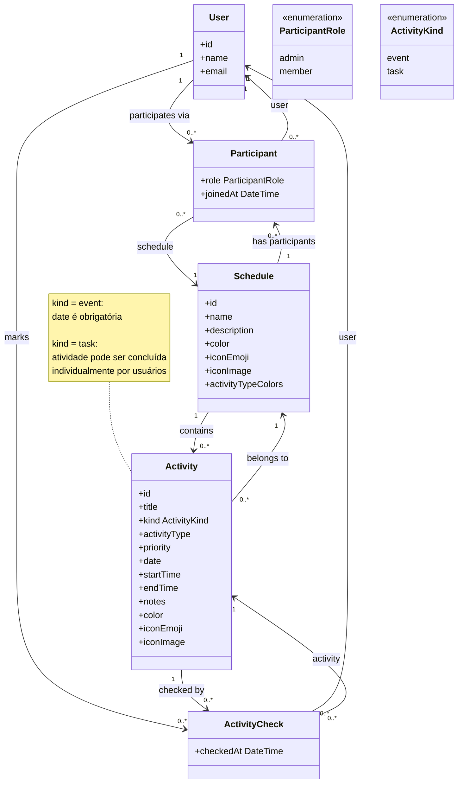
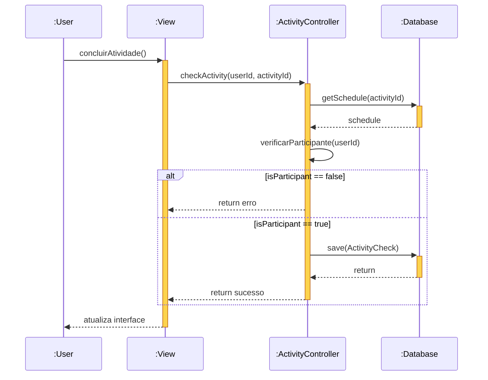

# Trabalho Prático de Engenharia de Software

## Membros e papéis
- Alessandro Mesa Teppa: fullstack
- Beatriz Camilly Gulart Pereira: fullstack
- Isabela Fernandes Guerra de Morais: fullstack
- Maria Eduarda Nunes e Carvalho de Vasconcelos Costa: fullstack

## Objetivo do sistema
O objetivo do sistema é criar um calendário que permita a organização de atividades acadêmicas, profissionais e pessoais. Para isso, ele possibilitará a criação de grupos (como turmas, equipes ou outros), com diferentes níveis de permissão entre administradores e participantes. O sistema oferecerá gerenciamento de eventos (aulas, reuniões, tarefas, provas, etc.), bem como acompanhamento de progresso, priorização de atividades e organização visual por cores, o que facilitará a identificação e o planejamento das atividades ao longo do tempo.

## Tecnologias
- Linguagem: python
- Framework: django
- Banco de dados: sqlite
- Agentes de IA: GitHub Copilot e Codex

## Como executar o sistema
### Pré-requisitos
Antes de começar, certifique-se de ter instalado:

- Python 3.10 ou superior  
- `make` (Linux/macOS ou WSL no Windows)
---
###  Passo a passo
1. Clone o repositório:
```bash
git clone https://github.com/MEduardaNunes/TP-ES.git
cd TP-ES
```
2. Instale as dependências e rode o servidor:
```bash
make run
```
3. Acesse no navegador:
```bash
http://127.0.0.1:8000/
```
4. Para parar o servidor, pressione: `Ctrl + C`
---
### Observações
- O comando `make run`:
    - cria o ambiente virtual automaticamente (se necessário)
    - instala as dependências
    - inicia o servidor Django

- O comando `make clean`:
    - limpa o ambiente venv

## Histórias de usuário
1. Como usuário do sistema, eu gostaria de me cadastrar/editar/visualizar/deletar meu usuário no sistema
2. Como administrador, eu gostaria de cadastrar/editar/visualizar/deletar uma agenda (com nome, descrição, cores e ícones) e suas atividades (eventos ou tarefas).
3. Como administrador, eu gostaria de cadastrar/editar/visualizar/deletar atividades da agenda.
4. Como administrador, eu gostaria de cadastrar/visualizar/deletar participantes de uma agenda
5. Como participante, eu gostaria de visualizar minhas agendas e suas atividades.
6. Como participante, eu gostaria de dar check em atividades já realizadas/estudadas, como provas, listas e trabalhos.
7. Como participante, eu gostaria de filtrar meus eventos com base nos filtros definidos, como agenda, tipo (tarefa/evento) e status (com check ou sem check), para visualizar apenas as atividades relevantes.
8. Como participante, eu gostaria de conseguir organizar meus estudos para disciplinas, entregas de trabalho e provas em matrizes de prioridade (urgente e importante/ urgente / importante / não urgente e nem importante)
9. Como usuário, para me motivar gostaria de personalizar a interface do sistema para ser mais de acordo com minha personalidade (poder alterar paleta de cores e adicionar meus próprios ícones)
10. Como usuário, eu quero que as listas de atividades tenham um campo de notas, para que eu possa registrar links, ideias ou informações necessárias para a execução da tarefa.
11. Como usuário, eu quero que, ao focar em uma disciplina, os itens internos ganhem cores específicas (ex: Prova = Vermelho, Lista = Laranja, Trabalho = Cinza, Estudo = Preto), para diferenciar as prioridades acadêmicas visualmente.

## Documentação do Sistema (UML)

### Diagrama de Classes
Este diagrama ilustra a estrutura de domínio do sistema, o que foi útil para compreender a modelagem dos dados e guiar a criação dos *models* no Django. Ele destaca:
- O controle de acesso e participação, onde a associação entre `User` e `Schedule` é mapeada pela classe `Participant` (definindo papéis de *admin* ou *member*).
- A composição das agendas, que abrigam múltiplas atividades (`Activity`), separadas logicamente entre eventos com datas fixas e tarefas concluíveis.
- O rastreamento de progresso individual, modelado pela classe associativa `ActivityCheck`, que permite que vários usuários marquem de forma independente a conclusão de uma mesma atividade.


### Diagrama de Sequência (Fluxo de ActivityCheck)
Este diagrama dinâmico ilustra o comportamento do sistema durante a marcação de uma atividade como concluída (História de Usuário 6). Útil para guiar a implementação da história no backend em Django, de forma a evidenciar as etapas de validação de permissões (verificar se o usuário é `Participant` do `Schedule`) antes de instanciar e persistir a classe `ActivityCheck` no banco de dados SQLite.

